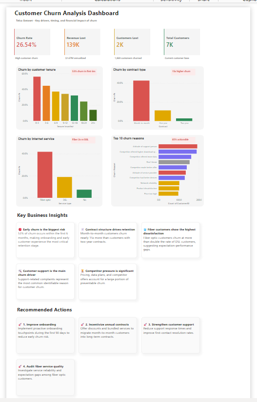

# Customer Churn Analysis Dashboard

## Overview
This project analyzes customer churn patterns for a telecommunications company using Power BI.  
The dashboard focuses on identifying the main drivers of churn, customer risk segments, and actionable business recommendations.

---

## Objectives
- Analyze churn behavior across customer segments
- Identify the highest-risk customer groups
- Understand the impact of contract types on retention
- Detect the most common churn reasons
- Provide strategic recommendations to reduce churn

---

## Tools Used
- Power BI
- Power Query
- DAX
- Data Visualization
- Business Storytelling

---

## Key Insights
- 53% of churn occurs within the first 6 months
- Month-to-month customers churn significantly more than long-term contracts
- Fiber optic customers show the highest churn rates
- Customer support issues are the leading identifiable churn reason
- Competitor offers account for a large portion of preventable churn

---

## Recommended Actions
- Improve onboarding during the first 90 days
- Incentivize annual and long-term contracts
- Strengthen customer support processes
- Audit fiber service quality and customer expectations

---

## Dashboard Preview

---

## Files Included
- `customer-churn-dashboard.pbix`
- Dashboard screenshots
- README documentation

---

## Author
Sujel Sikaffi
